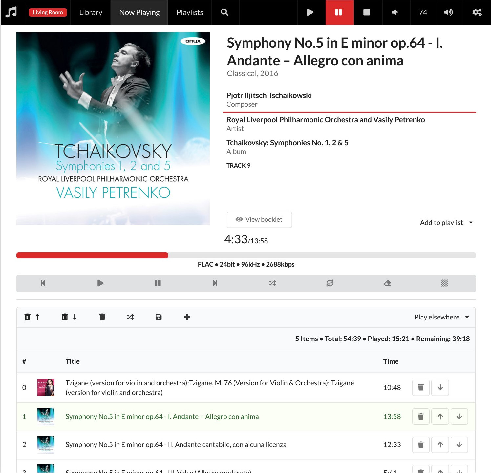

# MPC4S - music player daemon client

This project provides a Scala library for connecting to
[MPD](http://www.musicpd.org) and a web based user interface for
controlling MPD and browsing your music library.

Please see the [micro site](https://eikek.github.io/mpc4s/) for
more information.

## Feedback

As always, feedback is very welcome! Drop me a mail or create an
issue.

## License

This project is distributed under the
[GPLv3](http://www.gnu.org/licenses/gpl-3.0.html)
