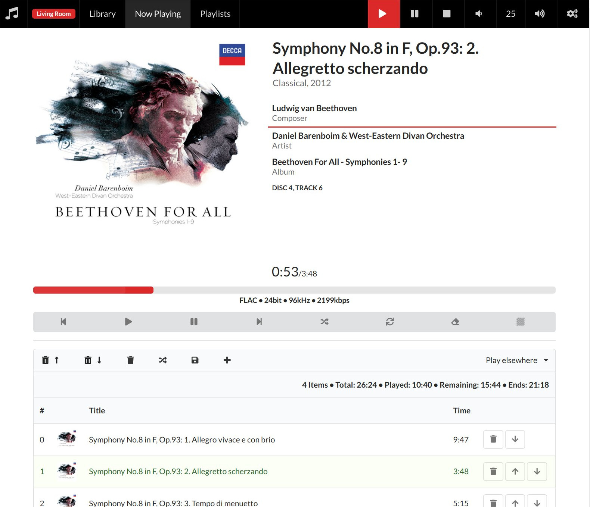

# MPC4S - music player daemon client

This is a scala library for talking to a [MPD](http://musicpd.org)
server and based on that a http bridge that exposes the mpd protocol
via REST and Websockets.

The project provides 4 modules, where 2 of them are libraries and the
other 2 applications build on top.

- [mpc4s-protocol](#mpc4s-protocol): Library implementing MPD's
  protocol in Scala
- [mpc4s-client](#mpc4s-client): Library for interacting with MPD
  using [fs2](https://github.com/functional-streams-for-scala/fs2)
- [mpc4s-http](#mpc4s-http): A http server that provides a REST-like
  interface to MPD as well as Websockets. It aims to allow easier
  building web clients for mpd.
- [mpc4s-player](#mpc4s-player): A webclient for MPD based on
  mpc4s-http

## mpc4s-player

A web application written in Elm that provides a simple frontend to
MPD. It uses the `mpc4s-http` module and communicates to MPD via
Websockets. It runs completely in the browser and only relies on MPD
commands and the additional cover routes provided by `mpc4s-http`.

Why? The main motivation was to have the following features:

- album-centric: I want to choose an album to listen to
- cover/album art support
- support for multi disc albums
- support for multiple MPD connections
- make use of the _composer_ tag

This is just to scratch my own itch: I tend to first choose an album
to listen to (in contrast to randomly playing from a huge playlist); I
have many multi-disc albums, mainly listening to classical music and
use multiple mds (on raspberry pis) with the same music collection… I
found many nice frontends, but I wanted something different :-). In
this respect it is a rather opinionated frontend.

In order to make it nice to work with, your music collection needs to
be tagged properly. The following tags are used:

- Title
- Album
- Genre
- Composer
- Artist, Albumartist
- Date (a year)
- Disc

The first three are quite important, the rest is nice to have. The
_Disc_ tag is optional, obviously.

Cover art is displayed by default and it is expected to find them by
looking in the music directory next to a song file. Several filenames
are tried and it can be configured. By default, the file 'cover.jpg'
is tried first. A missing cover is replaced by a generated image from
[robohash](https://robohash.org) using the album name as input. So at
least there are unique images per album.

### Getting it

This is just the `mpc4s-http` module packaged up with the elm
application.

You can download a tar ball from the release page, or build it
yourself with [sbt](https://scala-sbt.org):

```
sbt ";project player ;universal:packageBin"
```

You'll find a tar ball in `modules/player/target/universal`.

Please refer to the [mpc4s-http](#mpc4s-http) documentation about
configuring and running.

The app is by default available at `http://localhost:9600/player/` –
the trailing slash is important (for now). Multiple mpd connections
are supported and they can be changed in the settings page.

### Screenshot



Big thanks to [Semantic-UI](https://semantic-ui.com/) and
[Elm](http://elm-lang.org/). Pictures (e.g. not-found images) are
taken from [Unsplash](http://unsplash.com). Photographers include:

- [Jamison McAndie](https://unsplash.com/@jamomca)
- [Johannes Plenio](https://unsplash.com/@jplenio)

## mpc4s-http

This module buidls on `mpc4s-client` to create a http bridge to
MPD. It is the server part for the `mpc4s-player` application.  There
are two modes: 1) simple rest-like endpoints to issue commands to mpd
and 2) a websocket connection as an http interface to MPDs idle
concept. Responses from MPD are returned as JSON. The commands are
provided as standard MPD commands (just wrapped in a basic JSON
structure).

It also deals with cover images from the file system. This requires
that `mpc4s-http` can access the same music directory as MPD.

### Generic endpoint

```
POST /api/v1/mpd
Content-Type: application/json

{ "command": "some mpd command" }
```

This is the endpoint that hands a command as is to MPD. The return is
tha answer of MPD converted to JSON. For a list of commands, see [mpds
protocol
specification](https://musicpd.org/doc/protocol/command_reference.html).

The idea is that clients use this endpoint to run mpd commands. But
for convenience, there are special endpoints for some.

Responses from MPD are encoded in JSON wrapped in an outer
object. Here is an example for an idle answer:

```json
{
  "success": true,
  "type": "IdleAnswer",
  "result": {
    "changes": [
      "player"
    ]
  }
}
```

The outer object contains a field `success` which indicates whether
the response was an _OK_ from MPD. If MPD responded with an _ACK_ this
is false. If it is `true`, then there is a `result` field containing
the payload of the MPD response. If it is `false`, there is an `ack`
field that contains the JSON representation of MPD's ACK response. An
additional `type` field indicates which kind of response it is.

### Websocket

Using the endpoint `/api/v1/mpd` with a GET request allows to create a
websocket connection. This can be used to get notified about MPD
events and also to send commands (same json as above) to MPD using the
same connection. The websocket connection is directly connected to
MPD; that is the http server also uses only one connection to MPD for
the websocket.

When the websocket is opened, it responds with `IdleAnswer` events or
with answers as results to sending some commands through the
websocket. A json decoder can (for example) check the `type` field to
distinguish answer types.


### Special Endpoints

These are just convenient endpoints to execute mpd commands. Each one
corresponds to a single mpd command.

- `GET /api/v1/mpdspecial/search?tag=value&tag=value&range=0:2` This allows
to use the `search` and `find` command directly with an http GET
request. You can specify multiple tag/value pairs to search for and a
window range.
- `GET /api/v1/mpdspecial/list?listtype=value&genre=Classical&track=2`
  Executes MPD's `list` command. Here the `listtype` is literal and
  means the tag to list values for. Optionally multiple tag/value
  pairs can be specified for filtering.
- `GET /api/v1/mpdspecial/count?tag=value` Executes MPD's `count`
  command. There must be exactly one tag/value pair.
- `GET /api/v1/mpdspecial/currentsong` Executes the `currentsong` command.
- `GET /api/v1/mpdspecial/status` Executes the `status` command.
- `GET /api/v1/mpdspecial/playlistinfo?pos=2&range=1:3` Returns the current
  playlist or only a part of it if `pos` or `range` are specified. If
  both are given, then `pos` wins.
- `GET /api/v1/mpdspecial/listplaylists` Lists all stored playlists.


### Cover files

There are endpoints that deliver cover art for an album. One takes a
song file and tries to find the corresponding cover image. The other
takes an album name and looks up a file using MDP `find` command.

    GET /api/v1/cover/album?name=<albumName>
    GET /api/v1/cover/file/<file-uri.flac>

The cover is expected to be a file next to the songs in the
directory. Some names are tried (can be configured), and cover.jpg is
a default (it is tried first). For this to work, you need to configure
the same music directory as in your MPD config file. The cover images
are delivered directly from the file system and are not requested from
MPD.

If you have your cover art only inside each song, then currently that
cannot be served. You could simply export all of them into its own
file; for example for flac files:

```bash
find /music/dir -name "*.flac" -printf "%h\n" | uniq | while read f;
do
  cover="$f/cover.jpg"
  flac=$(ls -1 $f/*.flac | head -n1)
  if ! [ -r "$cover" ]; then
    echo "$f"
    metaflac --export-picture-to="$cover" "$flac"
  fi
done
```

Note that this script assumes that every song in a folder belongs to
the same album and share the same cover art!

#### Cache

When looking for cover art for an album, one song of that album is
requested from mpd and then its directory is searched for a cover
file. Since this always requires a call to mpd, the final paths to a
cover file are cached in memory. The assumption is, that these files
don't change (often). If they do, there is an endpoint to clear the
cache:

- `POST /api/v1/cover/clearcache`

So after startup the first load of all album covers takes a while; but
this should then speed up significantly.

Cover images are served as is; i.e. they are not resized. Large files
may slow down loading the album page. But since all images are also
cached in the browser this should only be annoying for the initial
load.

### Multiple MPD connections

If multiple mpd connections are configured, these are available using
its id after the usual endpoint ends. For example, `/api/v1/mpd` would
be `/api/v1/mpd/myid`, or `/api/v1/mpdspecial/currentsong` would be
`/api/v1/mpdspecial/myid/currentsong`. The connection with id
`default` (which is mandatory) is always reachable at the “default”
endpoints; additionally to its concrete form. For example, both
endpoints:

- `/api/v1/mpd` and
- `/api/v1/mpd/default`

are the same.


### Custom data

If you like to serve some static content, it is possible by
configuring a custom endpoint. Simply specify a directory and
everything below that is served at the `/custom/` endpoint.


### Dependencies

- `mpc4s-client`
- `fs2-http`: https://github.com/Spinoco/fs2-http
- `pureconfig`: https://github.com/Spinoco/fs2-http
- `logback-classic`: https://logback.qos.ch/
- `circe` (core, parser, generic): https://github.com/circe/circe
- `tika-core`: https://tika.apache.org/

### Usage

#### Getting it

If you want to run the app, build a package using
[sbt](https://scala-sbt.org). Clone the repo and run

```
sbt ";project http; universal:packageBin"
```

After this command finishes, you'll find a `tar.gz` in
`modules/http/target/universal/`.

Note that the only difference to the `mpc4s-player` module is that
this one doesn't contain the web application.

To run the app, execute `bin/mpc4s-http` script found in the extracted
tar ball.

This module is not published to maven central. Let me know if you need
it there.

#### Configuration

The application can be configured by a file that is given as an
argument to the application. See the
[reference.conf](modules/http/src/main/resources/reference.conf) file
for all default values. In particular, you'll probably want to
configure the following:

- `mpc4s.http.baseurl`: The base url to the application. This is used
  to construct urls.
- `mpc4s.http.bind.{host|port}`: The host and port to bind the http
  server to.
- `mpc4s.http.music-directory`: The music directory used by MPD. This
  is used to serve cover files from.
- `mpc4s.http.mpd.default.{host|port}`: Connection info to MPD.
- `mpc4s.http.mpd.default.max-connections`: The maximum allowed connections to
  MPD. This must be lower than the corresponding value in `mpd.conf`.

Please see the
[Spec](https://github.com/typesafehub/config/blob/master/HOCON.md) for
the config file format; or simply copy the `reference.conf` file and
adjust as needed. You only need to specify stuff that is different.

Other maybe useful bit is this setting: `mpc4s.http.custom-content`. It
allows to specify a directory where the server can serve files
from. For example, this can be used to serve a custom browser-based
application interacting with MPD.


## mpc4s-client

Building on the protocol module, this is a client library using
[fs2](https://github.com/functional-streams-for-scala/fs2).

The entry point is `MpdClient` which provides ways to send commands
and receive the response. It also provides the `idle` command as a way
to use a single connection for a longer time, being able to be
notified by mpd.

Some examples follow; these assume to have a `MpdClient` at
hand. Create it like this:

```scala
import scala.concurrent._, scala.concurrent.duration._
import java.nio.channels.AsynchronousChannelGroup
import java.util.concurrent._
import cats.effect.IO
import mpc4s.protocol._, mpc4s.protocol.commands._, mpc4s.client._

implicit val EC = ExecutionContext.fromExecutorService(Executors.newCachedThreadPool)
implicit val ACG = AsynchronousChannelGroup.withThreadPool(EC)

val mpc = MpdClient[IO](Connect("localhost", 6600))
```

Here is an example to send a simple command:

```scala
scala> val resp = mpc.send(Search(Filter.tags(Tag.Album -> "plays"), None, None), 5.seconds)
resp: fs2.Stream[cats.effect.IO,mpc4s.protocol.Response[mpc4s.protocol.answer.SongListAnswer]] = Stream(..)
scala> resp.compile.toVector.unsafeRunSync
res1: Vector[mpc4s.protocol.Response[mpc4s.protocol.answer.SongListAnswer]] = Vector(MpdResult(SongListAnswer(SongList(Vector(Song(Uri(Eike/classic/Ladislav Jelinek/Ladislav Jelinek plays Beethoven/01-Sonata C Major Op53 Waldstein Allegro con brio (L van Beethoven)-Ladislav Jelinek.flac),Some(2018-07-16T18:45:13Z),Some(Seconds(683)),Some(683.0),ListMap(Map(Title -> Sonata C Major Op53 Waldstein, Allegro con brio (L van Beethoven), Composer -> Ludwig van Beethoven, Album -> Ladislav Jelinek plays Beethoven, Track -> 1, Albumartist -> Ladislav Jelinek, Artist -> Ladislav Jelinek, Date -> 2011, Comment -> http://magnatune.com/artists/ladislav_jelinek, Genre -> Classical))), Song(Uri(Eike/classic/Ladislav Jelinek/Ladislav Jelinek plays Beethoven/02-Sonata C Major O...
```

In this example the codec for the response is chosen at compile
time. When the concrete command is not known at compile time, one can
use a runtime registry. Then a different `send` method is used:

```scala
scala> val resp = mpc.send1(Search(Filter.tags(Tag.Album -> "plays"), None, None), 5.seconds)
resp: fs2.Stream[cats.effect.IO,mpc4s.protocol.Response[mpc4s.protocol.Answer]] = Stream(..)
scala> resp.compile.toVector.unsafeRunSync
res2: Vector[mpc4s.protocol.Response[mpc4s.protocol.Answer]] = Vector(MpdResult(SongListAnswer(SongList(Vector(Song(Uri(Eike/classic/Ladislav Jelinek/Ladislav Jelinek plays Beethoven/01-Sonata C Major Op53 Waldstein Allegro con brio (L van Beethoven)-Ladislav Jelinek.flac),Some(2018-07-16T18:45:13Z),Some(Seconds(683)),Some(683.0),ListMap(Map(Title -> Sonata C Major Op53 Waldstein, Allegro con brio (L van Beethoven), Composer -> Ludwig van Beethoven, Album -> Ladislav Jelinek plays Beethoven, Track -> 1, Albumartist -> Ladislav Jelinek, Artist -> Ladislav Jelinek, Date -> 2011, Comment -> http://magnatune.com/artists/ladislav_jelinek, Genre -> Classical))), Song(Uri(Eike/classic/Ladislav Jelinek/Ladislav Jelinek plays Beethoven/02-Sonata C Major Op53 Waldstein I...
```

In the first example, the result type was a concrete anwser type
(`Response[SongListAnswer]`), because it could be found at compile
time. In the second example the result type is `Response[Answer]`
which must be casted to a concrete type first to be useful.

These commands open each a new connection to MPD and so the mpd
commands `idle`/`noidle` are not allowed. If you want to listen for
events, use the `idle` method on `MpdClient`. This opens a connection
and issues the `idle` command immediately. The interface to the single
connection is returned that allows to read responses and send
commands.

### Using

You can pull it from maven central:

```scala
"com.github.eikek" %% "mpc4s-client" % "0.1.0"
```

### Dependencies

This module has the following dependencies:

- `mpc4s-protocol`
- `fs2-core` and `fs2-io`: https://github.com/functional-streams-for-scala/fs2
- `log4s`: https://github.com/Log4s/log4s


## mpc4s-protocol

This is the foundation of the other modules in this project. It
implements most of MPDs commands using case classes. For each command
and its corresponding answer, there are conversions from/to case
classes.

For example, to parse a `find` command:

```
Welcome to Scala 2.12.6 (OpenJDK 64-Bit Server VM, Java 1.8.0_172).
Type in expressions for evaluation. Or try :help.
scala> import mpc4s.protocol._, mpc4s.protocol.codec._
import mpc4s.protocol._
import mpc4s.protocol.codec._

scala> val cc = CommandCodec.defaultCodec
cc: mpc4s.protocol.codec.LineCodec[mpc4s.protocol.Command] = mpc4s.protocol.codec.LineCodec$$anon$3@4d30831

scala> cc.parseValue("find album Echoes")
res0: mpc4s.protocol.codec.Result[mpc4s.protocol.Command] = Right(Find(Filter(ListMap(Map(TagFilter(Album) -> Echoes))),None,None))
```

The `CommandCodec.defaultCodec` can parse most mpd commands. There are
a few that are not included (all deprecated ones). In the example
above the command was parsed into an object of class `Find`. Every
command has its codec defined in its companion object.

The correct codec for a mpd responses depends on the command. The
commands specify its answer type using an implicit value of
`SelectAnswer`. For example, the `list` command expects its response
to be a `ListAnswer`.

You can find various command and answer types in the package
`mpc4s.protocol.commands` and `mpc4s.protocol.answer`, respectively.

This is a library and tries to be as minimal as possible. Currently,
[shapeless](https://github.com/milessabin/shapeless/) is the only
dependency.


### Using

You can pull it from maven central:

```scala
"com.github.eikek" %% "mpc4s-protocol" % "0.1.0"
```

## Feedback

As always, feedback is very welcome! Drop me a mail or create an issue.

## License

This project is distributed under the [GPLv3](http://www.gnu.org/licenses/gpl-3.0.html)
